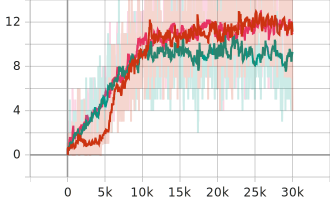
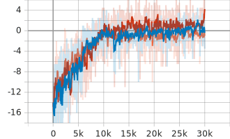
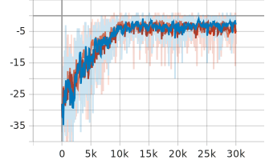

Predator-Prey Pytorch Multi-Agent RL (MARL)
==============

Predator-prey environment in this repository is modified version of the well-known predator-prey (Stone & Veloso, 2000) in the grid world, used in many other MARL research. State and action spaces are constructed similarly to those of the classic predator-prey game. “Catching” a prey is equivalent to having the prey within an agent’s observation horizon. We extend it to the scenario that positive reward is given only if multiple predators catch a prey simultaneously, requiring a higher degree of cooperation. The predators get a team reward of 1, if two or more catch a prey at the same time, but they are given negative reward −P, when only one predator catches the prey. (Reference [3])


Python Module Requirements
-----

* gym >= 0.11.0
* tensorboard >= 2.13.0


How to use
-----

### Details

- All below commands for **endless3** scenario with **2 predators & 1 prey**.
- Mixing network (e.g. VDN, QMIX, QTRAN) and penalty can be changed.
- More higher penalty, more **non-monotonic** environment becomes.   

### Commands

* **VDN**
    ```bash
    # With penalty 0.0
    python main.py --scenario endless3 --n_predator 2 --n_prey1 0 --n_prey2 1 --n_prey 1 --map_size 5 --train --training_step 3000000 --epsilon_decay_steps 1000000 --testing_step 10000 --max_step 100 --memory_size 300000 --df 0.99 --eval_episode 100 --agent_network rnn --mixing_network vdn --lr 5e-4 --seed 0 --penalty 0 --add_last_action --add_agent_id --use_random_update
    # With penalty 1.0
    python main.py --scenario endless3 --n_predator 2 --n_prey1 0 --n_prey2 1 --n_prey 1 --map_size 5 --train --training_step 3000000 --epsilon_decay_steps 1000000 --testing_step 10000 --max_step 100 --memory_size 300000 --df 0.99 --eval_episode 100 --agent_network rnn --mixing_network vdn --lr 5e-4 --seed 0 --penalty 10 --add_last_action --add_agent_id --use_random_update
    ```

* **QMIX**
    ```bash
    # With penalty 0.0
    python main.py --scenario endless3 --n_predator 2 --n_prey1 0 --n_prey2 1 --n_prey 1 --map_size 5 --train --training_step 3000000 --epsilon_decay_steps 1000000 --testing_step 10000 --max_step 100 --memory_size 300000 --df 0.99 --eval_episode 100 --agent_network rnn --mixing_network qmix --lr 5e-4 --seed 0 --penalty 0 --add_last_action --add_agent_id --use_random_update
    # With penalty 1.0
    python main.py --scenario endless3 --n_predator 2 --n_prey1 0 --n_prey2 1 --n_prey 1 --map_size 5 --train --training_step 3000000 --epsilon_decay_steps 1000000 --testing_step 10000 --max_step 100 --memory_size 300000 --df 0.99 --eval_episode 100 --agent_network rnn --mixing_network qmix --lr 5e-4 --seed 0 --penalty 10 --add_last_action --add_agent_id --use_random_update
    ```

* **QTRAN-base**
    ```bash
    # With penalty 0.0
    python main.py --scenario endless3 --n_predator 2 --n_prey1 0 --n_prey2 1 --n_prey 1 --map_size 5 --train --training_step 3000000 --epsilon_decay_steps 1000000 --testing_step 10000 --max_step 100 --memory_size 300000 --df 0.99 --eval_episode 100 --agent_network rnn --mixing_network qtran-base --lr 5e-4 --seed 0 --penalty 0 --add_last_action --add_agent_id --use_random_update
    # With penalty 1.0
    python main.py --scenario endless3 --n_predator 2 --n_prey1 0 --n_prey2 1 --n_prey 1 --map_size 5 --train --training_step 3000000 --epsilon_decay_steps 1000000 --testing_step 10000 --max_step 100 --memory_size 300000 --df 0.99 --eval_episode 100 --agent_network rnn --mixing_network qtran-base --lr 5e-4 --seed 0 --penalty 10 --add_last_action --add_agent_id --use_random_update
    ```


Experiment Results
-----

- Score curves of DQN agent and DRQN agent. DRQN agent overwhelms DQN agent
    <p align="left">
        
    </p>

- Score curves in order of zero-penalty, 0.5 penalty, and 1.0 penalty.
    <p align="left">
        
        
        
    </p>


Reference
-----

### Paper Reference

[1] [VDN](https://arxiv.org/pdf/1706.05296.pdf): Value-decomposition networks for cooperative multi-agent learning   
[2] [QMIX](https://www.jmlr.org/papers/volume21/20-081/20-081.pdf): Monotonic Value Function Factorisation for Deep
Multi-Agent Reinforcement Learning   
[3] [QTRAN](http://proceedings.mlr.press/v97/son19a/son19a.pdf): Learning to Factorize with Transformation for
Cooperative Multi-Agent Reinforcement learning   

### Code Reference

[4] https://github.com/Sonkyunghwan/QTRAN   
[5] https://github.com/Lizhi-sjtu/MARL-code-pytorch   